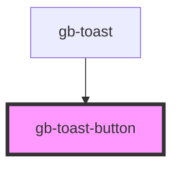

# gb-toast-button

<!-- Auto Generated Below -->

## Properties

| Property | Attribute | Description | Type                                                                                                                          | Default     |
| -------- | --------- | ----------- | ----------------------------------------------------------------------------------------------------------------------------- | ----------- |
| `color`  | `color`   |             | `"default" \| "discovery" \| "error" \| "gray" \| "information" \| "pink" \| "primary" \| "purple" \| "success" \| "warning"` | `undefined` |
| `state`  | `state`   |             | `StateEnum.Default \| StateEnum.Disabled`                                                                                     | `undefined` |

## Dependencies

### Used by

 - [gb-toast](../gb-toast)

### Graph

----------------------------------------------

*Built with [StencilJS](https://stenciljs.com/)*
