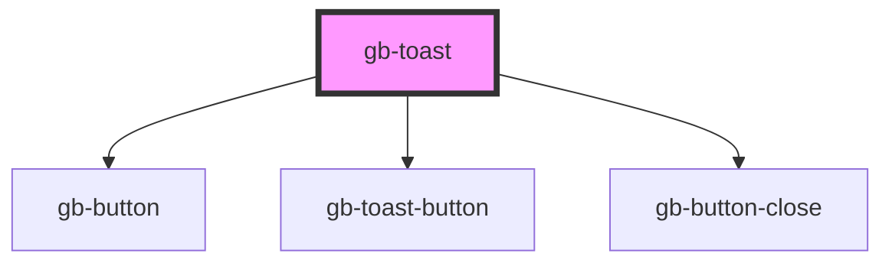

# gb-toast

<!-- Auto Generated Below -->

## Properties

| Property             | Attribute              | Description | Type                                                                                                                          | Default     |
| -------------------- | ---------------------- | ----------- | ----------------------------------------------------------------------------------------------------------------------------- | ----------- |
| `actions`            | `actions`              |             | `boolean`                                                                                                                     | `false`     |
| `breakpoint`         | `breakpoint`           |             | `"desktop" \| "mobile"`                                                                                                       | `undefined` |
| `color`              | `color`                |             | `"default" \| "discovery" \| "error" \| "gray" \| "information" \| "pink" \| "primary" \| "purple" \| "success" \| "warning"` | `undefined` |
| `showSupportingText` | `show-supporting-text` |             | `boolean`                                                                                                                     | `false`     |
| `size`               | `size`                 |             | `"floating" \| "full_width"`                                                                                                  | `undefined` |
| `xCloseButton`       | `x-close-button`       |             | `boolean`                                                                                                                     | `false`     |

## Dependencies

### Depends on

- [gb-button](../gb-button)
- [gb-toast-button](../gb-toast-button)
- [gb-button-close](../gb-button-close)

### Graph

----------------------------------------------

*Built with [StencilJS](https://stenciljs.com/)*
