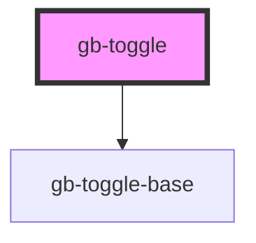

# gb-toggle

<!-- Auto Generated Below -->

## Properties

| Property         | Attribute         | Description | Type                                                                                                              | Default     |
| ---------------- | ----------------- | ----------- | ----------------------------------------------------------------------------------------------------------------- | ----------- |
| `size`           | `size`            |             | `"lg" \| "md" \| "profile_lg" \| "profile_md" \| "profile_sm" \| "sm" \| "xl" \| "xl2" \| "xl3" \| "xl4" \| "xs"` | `undefined` |
| `state`          | `state`           |             | `StateEnum.Active \| StateEnum.Disabled`                                                                          | `undefined` |
| `supportingText` | `supporting-text` |             | `boolean`                                                                                                         | `false`     |

## Dependencies

### Depends on

- [gb-toggle-base](../gb-toggle-base)

### Graph

----------------------------------------------

*Built with [StencilJS](https://stenciljs.com/)*
