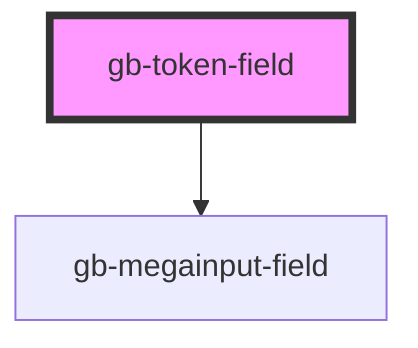

# gb-token-field

<!-- Auto Generated Below -->

## Properties

| Property             | Attribute              | Description | Type                                                                                                                       | Default         |
| -------------------- | ---------------------- | ----------- | -------------------------------------------------------------------------------------------------------------------------- | --------------- |
| `digits`             | `digits`               |             | `4 \| 6 \| 8`                                                                                                              | `undefined`     |
| `label`              | `label`                |             | `string`                                                                                                                   | `'Secure code'` |
| `showLabel`          | `show-label`           |             | `boolean`                                                                                                                  | `undefined`     |
| `showSupportingText` | `show-supporting-text` |             | `boolean`                                                                                                                  | `undefined`     |
| `size`               | `size`                 |             | `"lg" \| "md" \| "profile_lg" \| "profile_md" \| "profile_sm" \| "sm" \| "xl" \| "xl2" \| "xl3" \| "xl4" \| "xs" \| "xxs"` | `undefined`     |
| `supportingText`     | `supporting-text`      |             | `string`                                                                                                                   | `''`            |

## Dependencies

### Depends on

- [gb-megainput-field](../gb-megainput-field-base)

### Graph

----------------------------------------------

*Built with [StencilJS](https://stenciljs.com/)*
