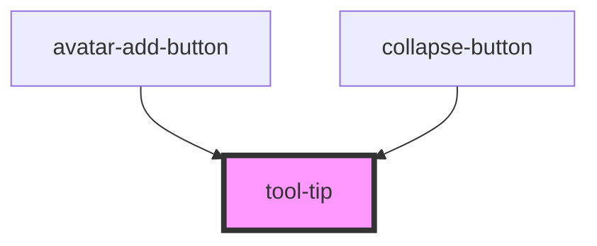

# tool-tip

<!-- Auto Generated Below -->

## Properties

| Property         | Attribute         | Description | Type                                                                                                | Default     |
| ---------------- | ----------------- | ----------- | --------------------------------------------------------------------------------------------------- | ----------- |
| `arrowPosition`  | `arrow-position`  |             | `"bottom_center" \| "bottom_left" \| "bottom_right" \| "left" \| "none" \| "right" \| "top_center"` | `'left'`    |
| `supportingText` | `supporting-text` |             | `boolean`                                                                                           | `undefined` |

## Dependencies

### Used by

 - [avatar-add-button](../avatar-add-button)
 - [collapse-button](../collapse-button)

### Graph

----------------------------------------------

*Built with [StencilJS](https://stenciljs.com/)*
