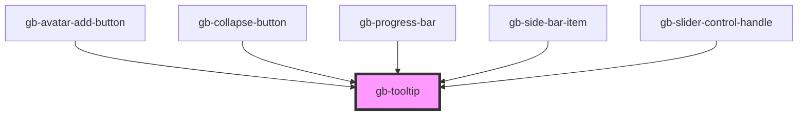

# test-tooltip

<!-- Auto Generated Below -->

## Properties

| Property             | Attribute              | Description | Type                                                                                                | Default           |
| -------------------- | ---------------------- | ----------- | --------------------------------------------------------------------------------------------------- | ----------------- |
| `arrow`              | `arrow`                |             | `"bottom_center" \| "bottom_left" \| "bottom_right" \| "left" \| "none" \| "right" \| "top_center"` | `'bottom_center'` |
| `showArrow`          | `show-arrow`           |             | `boolean`                                                                                           | `true`            |
| `showSupportingText` | `show-supporting-text` |             | `boolean`                                                                                           | `false`           |

## Dependencies

### Used by

 - [gb-avatar-add-button](../gb-avatar-add-button)
 - [gb-collapse-button](../gb-collapse-button)
 - [gb-progress-bar](../gb-progress-bar)
 - [gb-side-bar-item](../gb-side-bar-item)
 - [gb-slider-control-handle](../gb-slider-control-handle)

### Graph

----------------------------------------------

*Built with [StencilJS](https://stenciljs.com/)*
