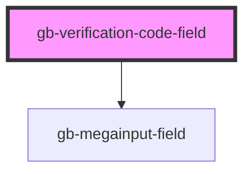

# gb-verification-code-field

<!-- Auto Generated Below -->

## Properties

| Property       | Attribute        | Description | Type                                                                                                                       | Default     |
| -------------- | ---------------- | ----------- | -------------------------------------------------------------------------------------------------------------------------- | ----------- |
| `digits`       | `digits`         |             | `4 \| 6 \| 8`                                                                                                              | `undefined` |
| `hintText`     | `hint-text`      |             | `string`                                                                                                                   | `''`        |
| `label`        | `label`          |             | `string`                                                                                                                   | `''`        |
| `showHintText` | `show-hint-text` |             | `boolean`                                                                                                                  | `undefined` |
| `showLabel`    | `show-label`     |             | `boolean`                                                                                                                  | `undefined` |
| `size`         | `size`           |             | `"lg" \| "md" \| "profile_lg" \| "profile_md" \| "profile_sm" \| "sm" \| "xl" \| "xl2" \| "xl3" \| "xl4" \| "xs" \| "xxs"` | `undefined` |

## Dependencies

### Depends on

- [gb-megainput-field](../gb-megainput-field-base)

### Graph

----------------------------------------------

*Built with [StencilJS](https://stenciljs.com/)*
